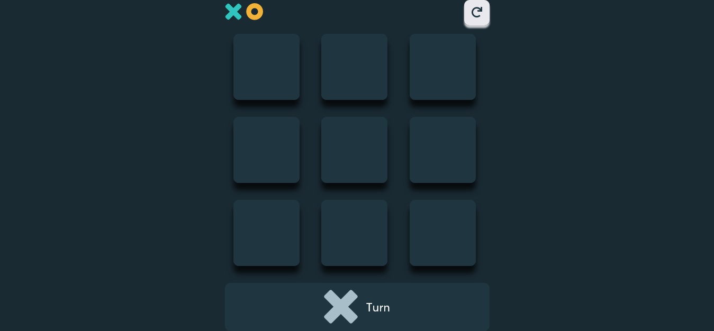
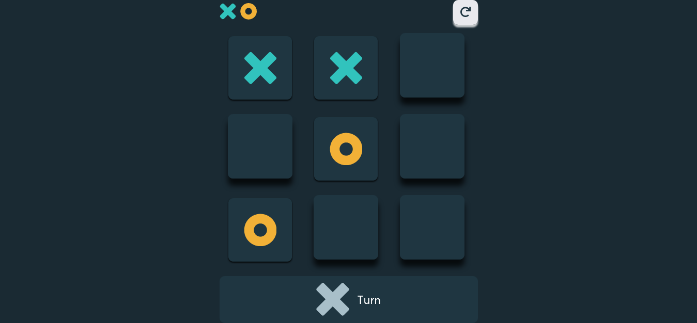

# Tic-Tac-Toe App

## Overview
### The Challenge
- Build a tic-tac-toe application using React JS
- Complete the solution by using React features such as 
  - Passing down props
  - Using CSS in JS
  - Building Components
  - React Hooks

### Links
- Solution URL: https://github.com/ChinyangaTL/tic-tac-toe-aca
- LiveSite URL: https://tic-tac-toe-aca-les.netlify.app/
  
### Built with
- Semantic HTML5 markup
- Flexbox
- [React](https://reactjs.org/) - JS library
- [Styled Components](https://styled-components.com/) 

### Images

